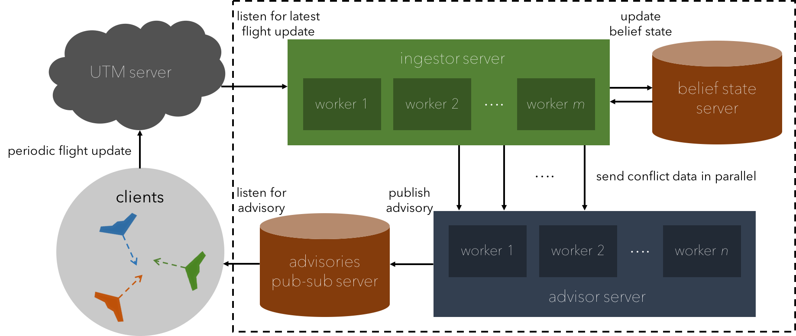

.. Discra documentation master file

========================================
Discra - Distributed Conflict Resolution
========================================

Discra (Distributed Conflict Resolution Architecture) is a distributed computing architecture used to implement the conflict avoidance algorithm detailed `here <http://web.stanford.edu/~haoyi/projects/short-term-conf-reso.pdf>`_ on a practical scale.

Discra is implemented using Apache Spark and Apache Kafka in Scala, but we've made it so you don't have to worry too much about these APIs. In fact, the architecture is designed to be modular such that you can swap out our conflict avoidance algorithm for your own. In this documentation, we provide a convenient entry point for users to replace our algorithm and test their own work using Discra.

Architecture
============

The Discra architecture shown below consists of four main components: (i) parallel ingestors that listen to state updates on the simulator server's data feeds, (ii) a belief state database that the ingestors store and read internal belief state representation from, (iii) parallel advisors that publish resolution advisories for drones in potential conflict, and (iv) a publish-subscribe advisory server that our simulator server listens to for resolution advisories. In this repository, we don't implement the belief state database since all of the flight state data fits comfortably in memory.

In Depth Documentation
======================

.. toctree::
  :maxdepth: 2

  Installation <installation>
  Kafka Server <kafka>
  Spark Application <spark>
  Policy Entry Point <policy>
