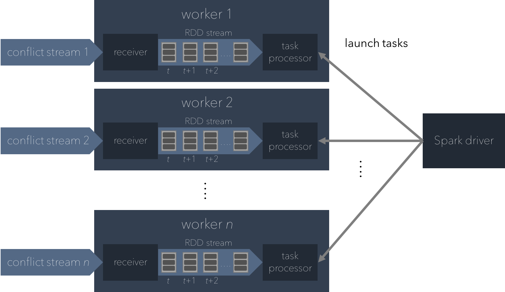

=================
Spark Application
=================

Spark in Discra
===============

The ingestor and advisor servers are implemented on the Spark Streaming library, which provides a scalable, fault-tolerant stream processing system. In brief, the Spark programming model is centered around the resilient distributed datasets (RDDs) abstraction. RDDs are distributed, partitioned collections of objects that are manipulated through parallel transformations that, in our case, are algorithms that process flight states and conflict messages.

Spark Streaming
---------------

In Spark Streaming, there are multiple executors that each contain a receiver and a task processor. These executors are managed by a process manager/scheduler called a driver, which launches tasks and, if needed, broadcasts objects to the worker nodes.

Advisor Server
--------------

In the advisor server's case, the Spark driver broadcasts policy objects, which contains the lookup table for the pairwise encounter MDP. Receivers buffer data streams in the executors' memory and chop them up into periodic batches. These periodic batches are implemented as an infinite stream of RDDs, which contain flight state XML objects from the UTM client server and formatted JSON conflict messages from the ingestor server. Once these RDDs are created, the Spark driver launches and delegates tasks to worker nodes.

Each task consists of multiple objects that are processed by the worker node they are buffered in. The multiple worker nodes in the Spark processing engine then processes these batches of data based on a user-defined algorithm that, in our case, tracks aircraft and resolves conflicts on our ingestor and advisor servers, respectively.

The figure below illustrates this computing model for the advisor Spark application.

Running Spark
=============

Unlike Kafka, everything that needs to run the Spark application already exists in the repository. You can simply run the application from IntelliJ IDEA by clicking the run button from the right-click drop-down menu on the files found at

  1. ``[discra-root]/src/advisor/src/test/scala/spark/driver/Test.scala``
  2. ``[discra-root]/src/ingestor/src/test/scala/ingestor/Test.scala``
  3. ``[discra-root]/src/simulator/src/test/scala/simulator/Test.scala``

Note that you need to run these applications in that order, otherwise the simulator server will be sending flight state updates with no server listening and processing that information.
